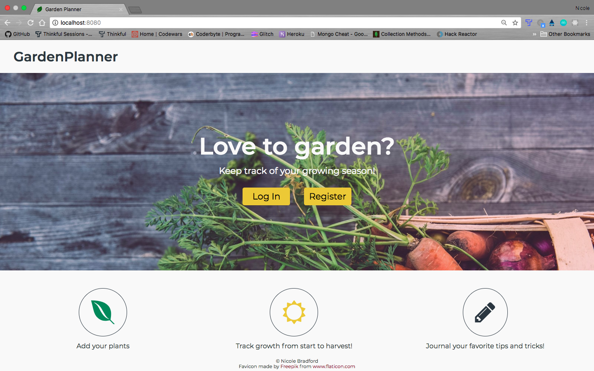
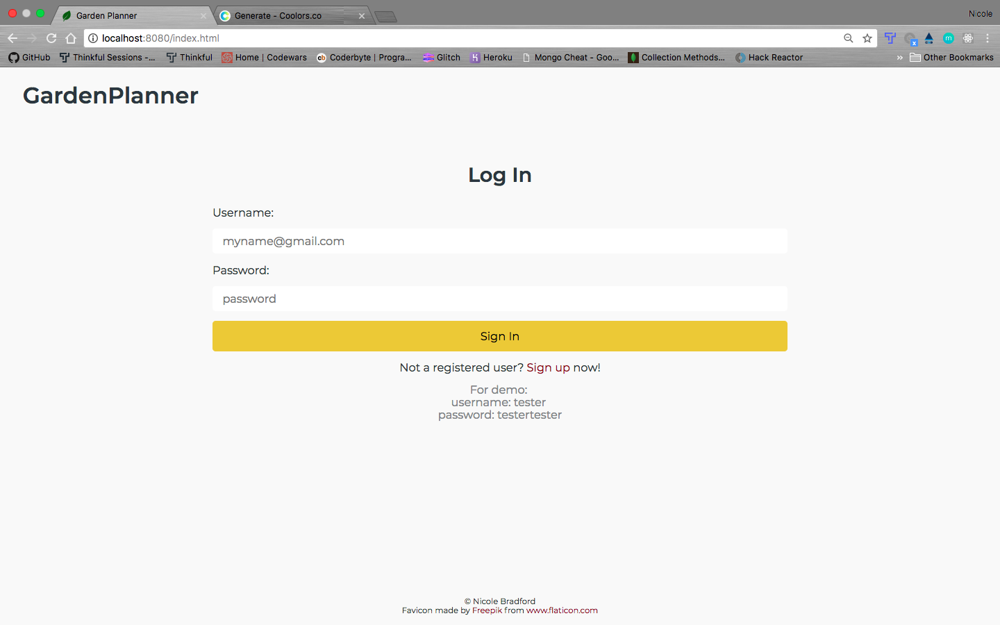
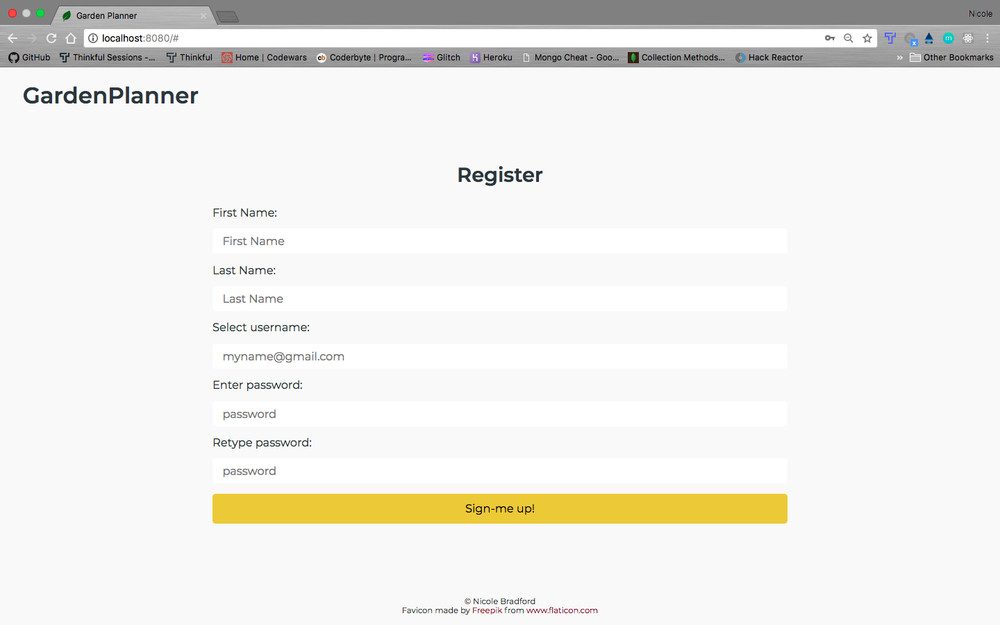
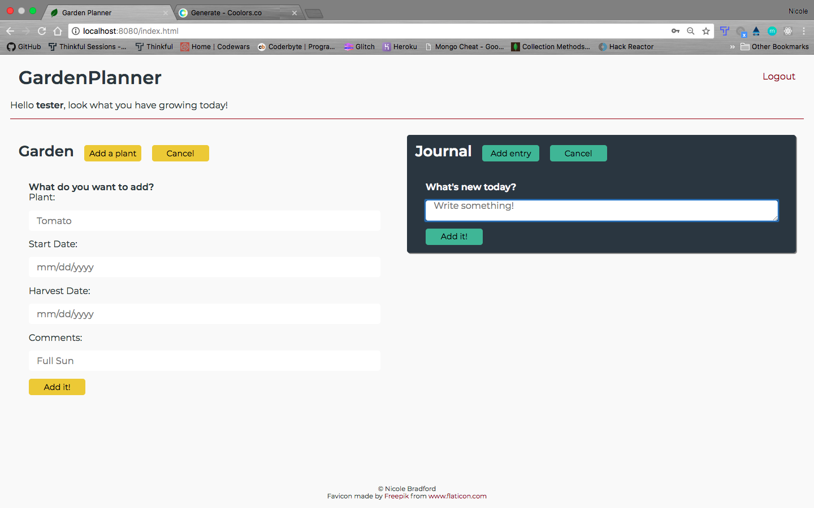
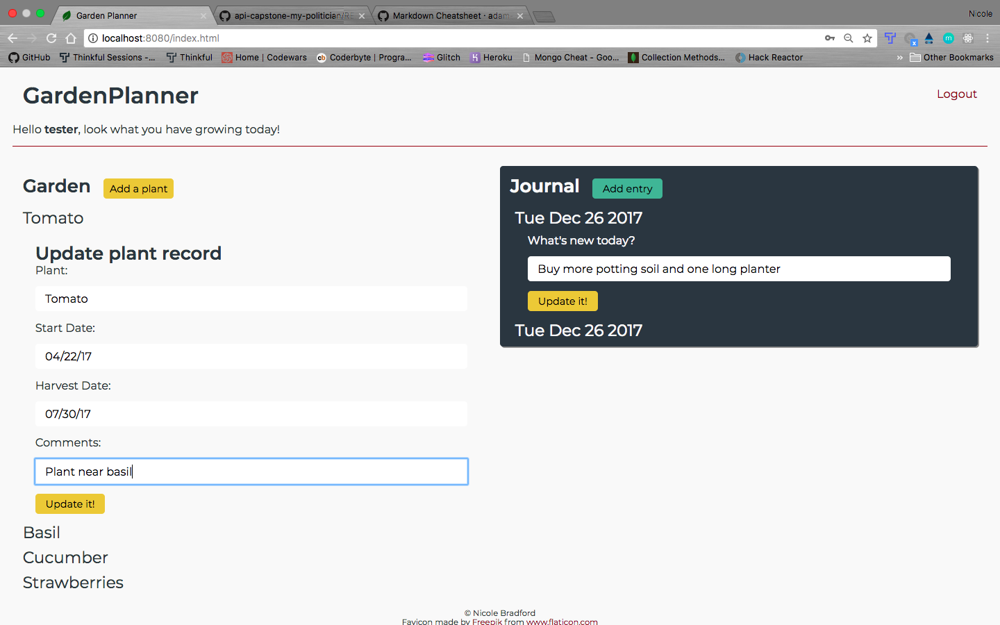

<h1>GardenPlanner</h1>

<a href="https://www.thinkful.com/">Thinkful</a> Node Capstone Project - Full stack capstone app integrating FEWD with <a href="https://nodejs.org/en/">Node.js</a> server-side development/CRUD operations

<h2>Use Case</h2>

This app helps users plan and keep track of their garden.

<h2>Functionality</h2>

This app's functionality includes:

<ul>
	<li>Add a plant with start date, harvest date, and a comment</li>
	<li>Add a journal entry</li>
	<li>Display a user's plant and journal information</li>
	<li>Update a user's plant and journal information</li>
	<li>Delete a user's plant and journal information</li>
</ul>

<h2>Technology</h2>
<h3>Front End</h3>
<ul>
	<li>HTML</li>
	<li>CSS</li>
	<li>JavaScript</li>
	<li>jQuery</li>
	<li>AJAX JSON calls to the app's API</li>
</ul>

<h3>Back End</h3>
<ul>
	<li>Node.js</li>
	<li>Express</li>
	<li>Mocha</li>
	<li>Chai</li>
	<li>Mongo</li>
	<li>Mongoose</li>
	<li>bcryptjs</li>
	<li>Passport</li>
</ul>

<h3>Programs</h3>
<ul>
	<li>Heroku</li>
	<li>TravisCI</li>
	<li>mLab</li>
</ul>

<h2>Working Prototype</h2>

A working prototype of this app can be viewed at <a href="https://pacific-everglades-69820.herokuapp.com">https://pacific-everglades-69820.herokuapp.com</a>

<h2>Responsive Design</h2>

This app is built to be responsive across mobile, tablet, laptop, and desktop screens.

<h2>Development</h2>

Future updates are expected to include:

<ul>
	<li>Add third-party API to get user's growing zone</li>
	<li>Add diagram for garden layouts</li>
</ul>

